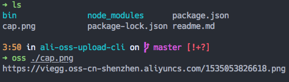

## ali-oss-upload-cli

### usage


### install
- git clone this repo && cd this repo
- edit `./bin/oss` to add your aliyun accesskey id and secret
- run `npm link` to add `oss` to PATH

have fun!

### I don't want `oss` to be the command name
just edit `package.json` like this
```js
  "bin": {
    "whatever-cmd-you-like": "./bin/oss"
  }
```

### license
MIT
